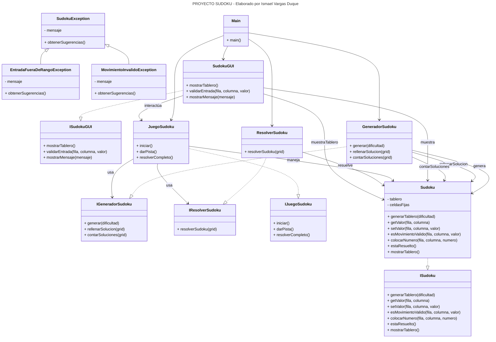

```mermaid
---
title: PROYECTO SUDOKU - Elaborado por Ismael Vargas Duque
---
classDiagram
    class SudokuException {
      - mensaje
      + obtenerSugerencias()
    }
    class EntradaFueraDeRangoException {
      - mensaje
      + obtenerSugerencias()
    }
    class MovimientoInvalidoException {
      - mensaje
      + obtenerSugerencias()
    }

    SudokuException <|-- EntradaFueraDeRangoException
    SudokuException <|-- MovimientoInvalidoException

    class IGeneradorSudoku {
      + generar(dificultad)
      + rellenarSolucion(grid)
      + contarSoluciones(grid)
    }
    class ISudoku {
      + generarTablero(dificultad)
      + getValor(fila, columna)
      + setValor(fila, columna, valor)
      + esMovimientoValido(fila, columna, valor)
      + colocarNumero(fila, columna, numero)
      + estaResuelto()
      + mostrarTablero()
    }
    class IResolverSudoku {
      + resolverSudoku(grid)
    }
    class IJuegoSudoku {
      + iniciar()
      + darPista()
      + resolverCompleto()
    }
    class ISudokuGUI {
      + mostrarTablero()
      + validarEntrada(fila, columna, valor)
      + mostrarMensaje(mensaje)
    }

    class GeneradorSudoku {
      + generar(dificultad)
      + rellenarSolucion(grid)
      + contarSoluciones(grid)
    }

    GeneradorSudoku ..|> IGeneradorSudoku
    GeneradorSudoku --> Sudoku : genera
    GeneradorSudoku --> Sudoku : rellenarSolucion
    GeneradorSudoku --> Sudoku : contarSoluciones

    class Sudoku {
      - tablero
      - celdasFijas
      + generarTablero(dificultad)
      + getValor(fila, columna)
      + setValor(fila, columna, valor)
      + esMovimientoValido(fila, columna, valor)
      + colocarNumero(fila, columna, numero)
      + estaResuelto()
      + mostrarTablero()
    }

    Sudoku ..|> ISudoku

    class JuegoSudoku {
      + iniciar()
      + darPista()
      + resolverCompleto()
    }
    class ResolverSudoku {
      + resolverSudoku(grid)
    }
    class Main {
      + main()
    }

    JuegoSudoku ..|> IJuegoSudoku
    ResolverSudoku ..|> IResolverSudoku
    Main --> JuegoSudoku
    Main --> ResolverSudoku
    Main --> GeneradorSudoku
    Main --> SudokuGUI

    class SudokuGUI {
      + mostrarTablero()
      + validarEntrada(fila, columna, valor)
      + mostrarMensaje(mensaje)
    }

    SudokuGUI ..|> ISudokuGUI
    SudokuGUI --> Sudoku : muestra

    JuegoSudoku --> IGeneradorSudoku : usa
    JuegoSudoku --> IResolverSudoku  : usa
    JuegoSudoku --> Sudoku           : maneja
    ResolverSudoku --> Sudoku         : resuelve
    SudokuGUI --> JuegoSudoku         : interactúa
    SudokuGUI --> Sudoku              : muestraTablero

```